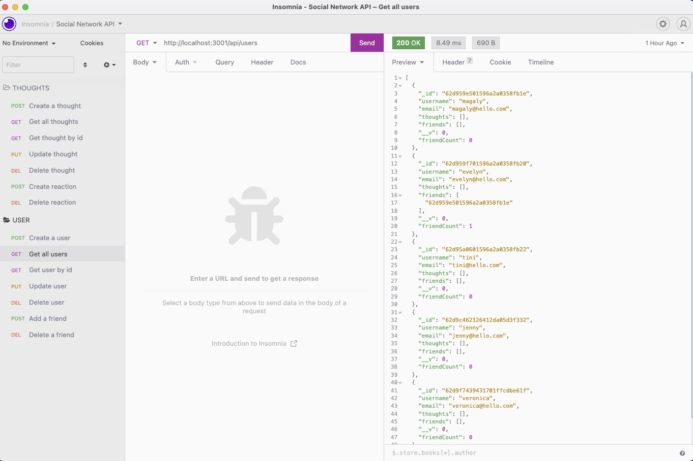
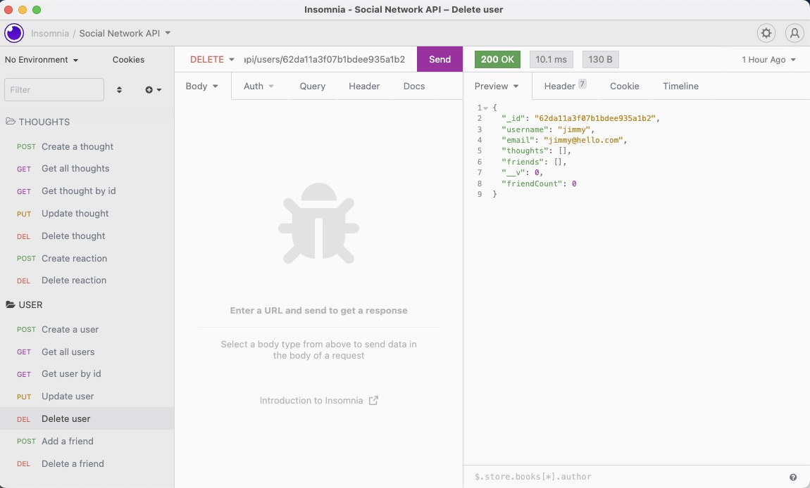
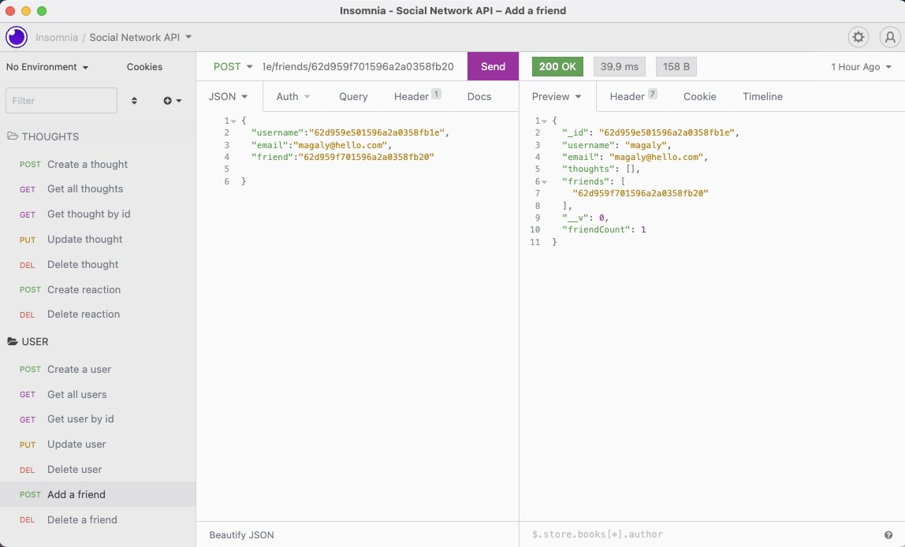
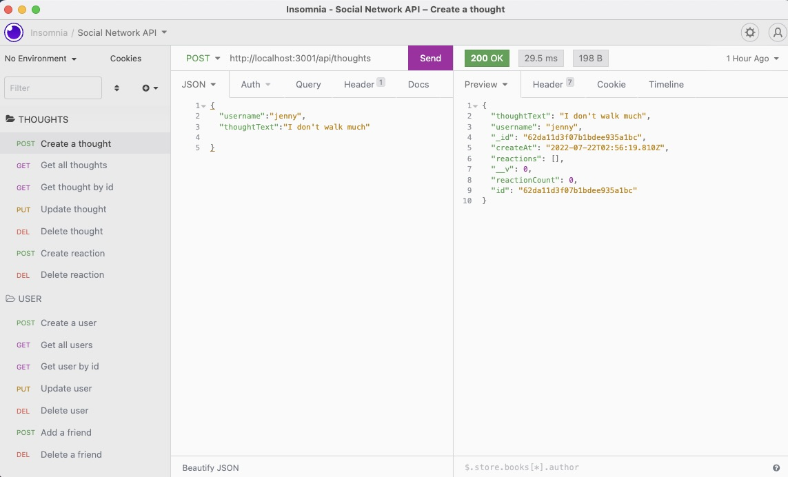
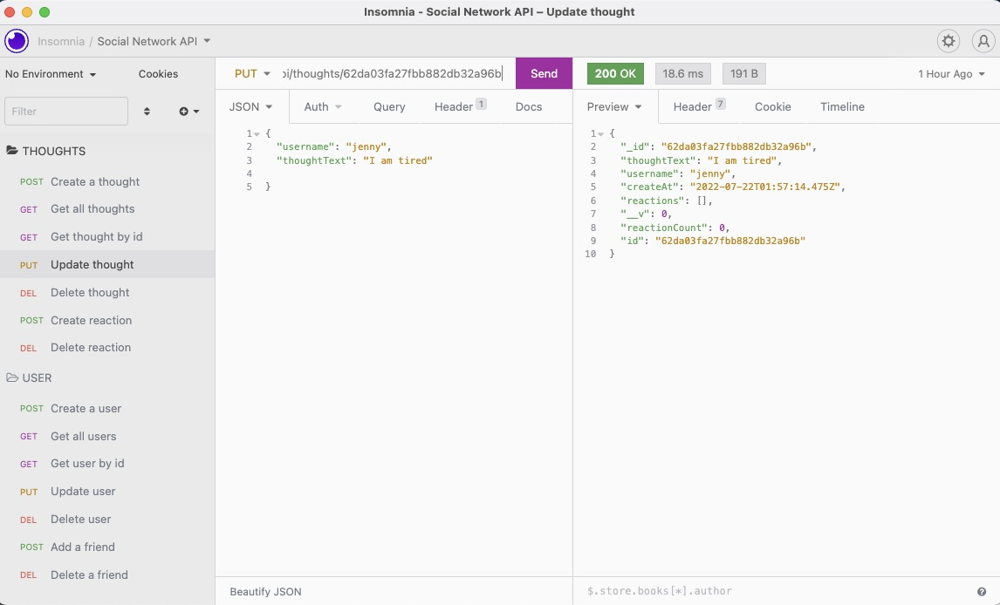

# 18 NoSQL: Social Network API

## Description

MongoDB is a popular choice for many social networks due to its speed with large amounts of data and flexibility with unstructured data. 
This is an API for a social network web application where users can share their thoughts, react to friends’ thoughts, and create a friend list. I use Express.js for routing, a MongoDB database, and the Mongoose ODM. 

## Installation
Clone the repo from GitHub, and install node.js on your computer, in the command line, run npm start.

## Mock Up

The following images show examples of the application's API routes being tested in Insomnia.

The following image shows GET route to get all users being tested in Insomnia:

The following image shows DEL route to delete a single user being tested in Insomnia:

The following image shows the POST route for creating a friend being tested in Insomnia:

The following image shows the POST route for a thought being tested in Insomnia:

The following image shows the PUT route for updating a thought being tested in Insomnia:

### Walkthrough Video:

Clicking [this link](https://drive.google.com/file/d/16_R4Ii1icnAS7S89n7bc7KvLNPI1JRhE/view) you will find the video with the demonstration of the app.
